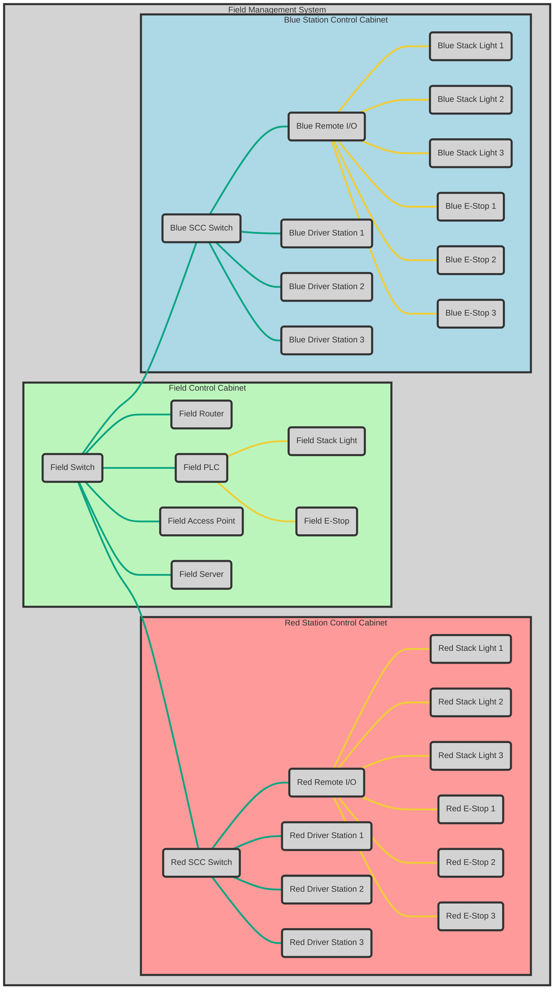

# Field Network Topology

The network topology of our FMS implementation is pretty much exactly the same as the official FIRST one but with slightly different hardware. I suggest reading the FMS whitepaper if you would like to understand it more in depth. You can find that [here](https://fms-manual.readthedocs.io/en/latest/fms-whitepaper/fms-whitepaper.html).

